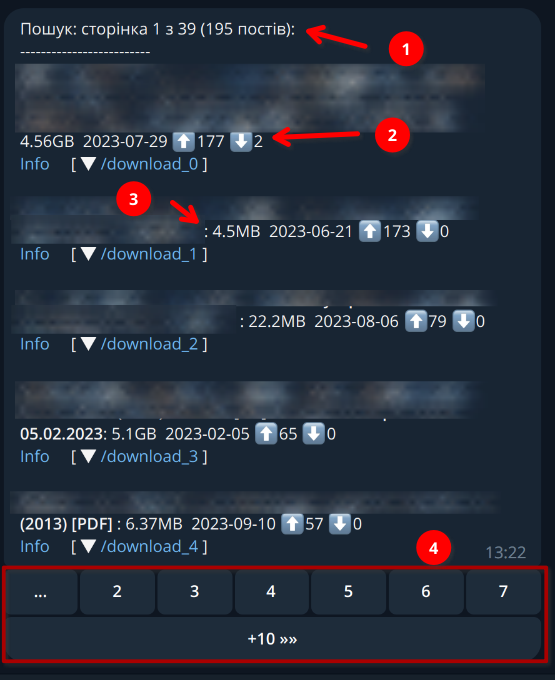

# Transmission telegram bot


This Telegram bot is a small piece of software for Searching torrents on tracker websites and passing to Transmission torrent server.

**Features:**

- **Manage** torrents on Transmission server:
  - Start, Stop, Delete and view torrents on transmission server
  - Select download folder before adding torrent to transmission
  - You could use built-in search option on list of predefined trackers or copy/paste torrent file, url or magnet link into the bot chat.
- **Search** torrents using bot:
  - Bot has pre-configured websites to find torrents
  - You can configure the way to display search results by changing sort and filter options. It will help you to find torrents with great number of seaders, or video content with better quality.
- **Authentication and Security**:
  - Bot uses built-in protection authentication verification. You don't have to worry about hacking.
  - You can easily share access to bot with family members using QR Code or link. Check `/adduser` command.

Features are independent of each other. E/g: If you would like to manage torrents only you could disable search and vice versa.

Additionally you could setup home DLNA server like Jellyfin, Plex or MiniDLNA and stream downloaded Video and Audio content to your smartTV, speakers, etc.


**Supported trackers:**
* http://nnmclub.to/
* http://rutor.info 
* https://kat.sx/
* https://toloka.to

(new will arrive soon)

# Installation

## What you will need to run bot?
1. **Hardware:**
   - If you are planning to use Bot as standalone application for searching torrent and pushing them to external Transmission, no specific configuration is required.
   - If you are planning to run Bot and Transmission on the same hardware, make sure you have at least 2G of RAM and 100G+ storage. Actual setup takes less then 1G, but you will need place to download torrents.
   - Bot and transmission will run on any hardware architecture including Apple M1/2 chips and ARMs.
2. **Software:** 
   - Bot will work well on one of the following configuration:
      - Any Windows, Mac OS, Linux, FreeBSD OS/distribution with Python 3.10+. Bot may also run on any other operating system with Python 3.10+ support.
      - Any OS with support for Docker 20.0.4+ and docker-compose 3+.
   - Transmission, please check available packages at: https://transmissionbt.com/download or use one of the available docker images
   
   

## Preparation
1. Register new telegram bot using [@BotFather](https://t.me/botfather).
2. Configure Transmission server authentication with username and password:
   - For rpm or deb package use official doc: https://github.com/transmission/transmission/tree/main. Detailed setup instruction is [here](doc/Transmission-setup.md)
   - For docker image https://hub.docker.com/r/linuxserver/transmission please check `docker-compose.yaml` for available options.
3. Register accounts on torrent trackers (credentials needs to be added to configuration file later):
   * http://nnmclub.to
   * https://toloka.to

## Run bot locally

1. Clone this repository
   ```
   git clone https://github.com/adskyiproger/transmission-telegram-bot.git
   ```
   or download as zip file: https://github.com/adskyiproger/transmission-telegram-bot/archive/refs/heads/master.zip
2. Update config/torrentino.yaml configuration file. Follow up comments inside configuration file:
   ```
   cp templates/torrentino.sample.yaml config/torrentino.yaml
   nano config/torrentino.yaml
   ```
3. Run:
   ```
   pip install --user pipenv
   pipenv install
   pipenv run ./torrentino.py
   ```

## Run in docker

1. Clone this repository
   ```
   git clone https://github.com/adskyiproger/transmission-telegram-bot.git
   ```
2. Update torrentino.yaml configuration file. Follow up comments inside configuration file:
   ```
   torrentino.yaml
   ```

3. Build docker image:
   ```
   docker build -t my-bot . 
   ```
4. Start docker container as daemon process:
   ```
   docker run -d -v `pwd`/torrentino.yaml:/usr/src/app/torrentino.yaml my-bot
   ```
5. Check container logs.


**Complete installation Guide for Raspberry Pi 4 can be found at [Home DLNA on Raspberry Pi4 setup guide](doc/Home-DNLA-setup.md)**


# User Guide

## Menu options / Bot Commads

List of menu options (bot commands):

- `/torrents`, List torrents on Transmission server
- `/last_search`, Show last search results. Keep in mind search results are cached for 60 minutes.
- `/stop_all`, Stop seeding and leaching all torrents
- `/start_all`, Start seeding and leaching all torrents
- `/history`, Show downloaded torrents history. Only successfully downloaded torrents are added to the history.
- `/help`, Display help message
- `/adduser`, Generates QR-Code and link for adding new bot user. Command is available only for administrator

## Search window

Search window content:

1. Top string shows current page, total number of pages and total number of found posts (torrents).
2. Each post has information about seaders (⬆️) and leachers (⬇️). `Info` could be used to open post page on torrent tracker.
3. Each post has information about torrent size and when torrent was posted on torrent tracker. E/g: `4.56GB  2023-07-29`
4. Navigation bar allows quick switch between pages or jump +/-10 pages.




## Other screenshots

### Bot Main window
- Last search results are available by pressing "Search" button.
- List of downloaded torrents is available by pressing "Torrents" button.


### Adding new user

After initial configuration new users can be added by typing `/adduser` command. As output you will get a registration link and QR-code.


