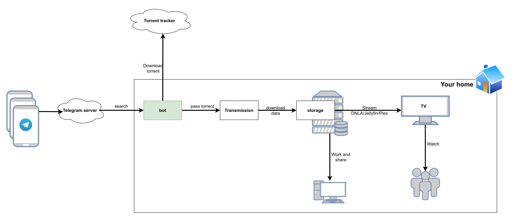
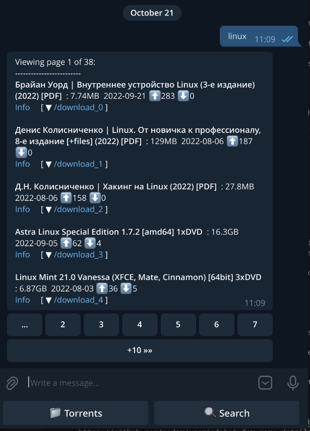
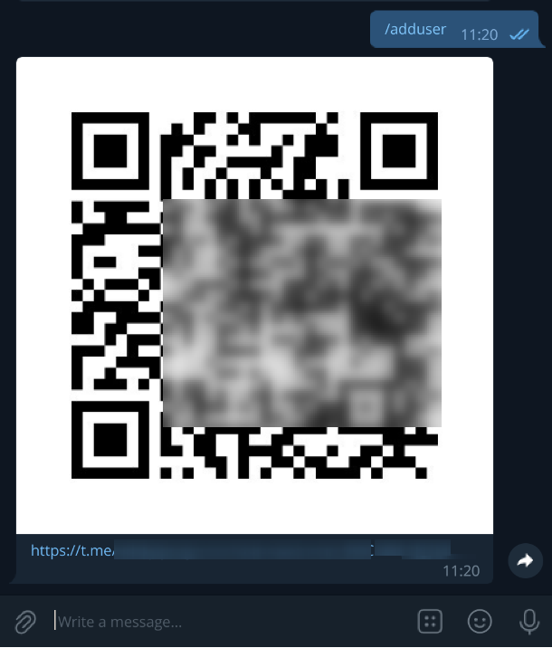

# Transmission telegram bot


**How many time you spend to find torrent on internet, download file on your computer, add it your favorite torrent programm and then wait for file to download?**

Telegram bot is a small piece of software for Searching torrents on tracker websites and passing to Transmission torrent server:

- Bot uses website search form to find torrents and returns to user search results in the format of "Title / Size / Publish data / Seeders / Leachers". Results are slit by pages for simplisity and can be sorted by any field. It will help you to find torrents with great number of seaders, or video content with better quality.
- Bot will allow you to add torrent file to your server from any device running Telegram client. You could use built-in search option on list of predefined trackers or copy/paste torrent file, url or magnet link into the bot chat.
- Bot allows you to select download folder on Transmission server. Downloaded content is structured withing folders.
- Bot supports main Transmission server actions such as `Stop`, `Start`, `Delete`, `View info`.
- Bot uses built-in protection authentication verification. You don't have to worry about hacking.
- You can easily share access to bot with family members using QR Code or link. Check `/adduser` command.



With help of other tools like Samba [1], Jellyfin [2] or Plex [3] You may streem downloaded Videos and Music on your TV. Check "Advanced setup section".

# Supported trackers:
* http://nnmclub.to/
* http://rutor.info 
* https://kat.sx/
* https://toloka.to

(new will arrive soon)

# Screenshots

## Bot Main window
- Last search results are available by pressing "Search" button.
- List of downloaded torrents is available by pressing "Torrents" button.



## Adding new user

After initial configuration new users can be added by typing `/adduser` command. As output you will get a registration link and QR-code.




# Usage

This Bot could be used as satelite for Transmission server for search torrent files on predifined web sites. 
Additionally you could setup home DLNA server like Jellyfin or MiniDLNA.

Before building docker image or running python script please register new telegram bot using `BotFather`.
Place bot security token into torrents.yaml.

Get your telegram user id with https://t.me/userinfobot. See https://github.com/nadam/userinfobot for more details.

## Preparation
1. Install and configure transmission server web interface with username and password.
   You could use docker image https://hub.docker.com/r/linuxserver/transmission instead of manual (rpm/deb) setup.
   Please check `docker-compose.yaml`
2. Update torrentino.yaml configuration file.

## Run python script

1. Clone this repository
   ```
   git clone https://github.com/adskyiproger/transmission-telegram-bot.git
   ```
   or download as zip file: https://github.com/adskyiproger/transmission-telegram-bot/archive/refs/heads/master.zip
2. Update configuration file:
   ```
   # check comments inside the file
   torrentino.yaml
   ```
3. Run:
   ```
   pip install --user pipenv
   pipenv install
   pipenv run ./torrentino.py
   ```

## Run in docker


1. Build docker image:
   ```
   docker build -t my-bot . 
   ```
2. Start docker container as daemon process:
   ```
   docker run -d -v `pwd`/torrentino.yaml:/usr/src/app/torrentino.yaml my-bot
   ```
3. Check container logs.


# Home DLNA on Raspberry Pi4 setup guide

This section describes how to build home DLNA solution on Raspberry Pi4 with external HDD. 

## Hardware list:

1. Raspberry Pi4 device (4G RAM).
2. External HDD formatted as `ext4` (this guide use `/data/Media` as mountpoint). 

## Software list:

1. Docker with docker-compose. Guides how to setup docker and docker-compose could be found online.
2. Jellyfin docker imagei https://hub.docker.com/r/linuxserver/jellyfin (https://jellyfin.org/).
3. Transmission docker image https://hub.docker.com/r/linuxserver/transmission (https://transmissionbt.com/).
4. Transmission telegram bot docker image built from this repo.


## Installation steps

1. Create folders inside `/data/Media` to organize your data.
For example: Video, TVShows, Soft, Music.:
   ```
   mkdir -p /data/Media/{Video,TVShows,Soft,Music}
   ```
   **NOTE:** You are not limited to single directory and you can use existing folders. Check `DIRECTORIES` section in configuration file `torrentino.yaml`

2. Create dedicated user `dlna` for running docker containers and make this user owner of `/data/Media`:
   ```
   sudo useradd -m -G docker dlna
   sudo chown -R dlna:dnla /data/Media
   ```
3. Login as `dlna` user: 
   ```
   sudo su - dlna
   ```
4. Clone this git repo into home folder and build transmission-telegram-bot docker image:
   ```
   git clone https://github.com/adskyiproger/transmission-telegram-bot.git
   cd transmission-telegram-bot/
   docker build -t transmission-telegram-bot .
   ```
5. Navigate back into home directory and create directory structure to persist docker containers data:
   ```
   cd ~
   mkdir -p docker/{jellyfin,torrentino,transmission}/config
   ```
6. Copy Bot configuration file `torrentino.docker.yaml` into `~/docker/torrentino/config` and create empty log file:
   ```
   cp ~/transmission-telegram-bot/torrentino.docker.yaml ~/docker/torrentino/config/torrentino.yaml
   touch docker/torrentino/torrentino.log
   ```
7. Change owner, bot is running under non-root user and to get read/write access to `~/docker/torrentino/`, owner need to be changed to UID 2022 and GUID 2022:
   ```
   chown -R 2022:2022 ~/docker/torrentino/
   ```
8. Open `~/docker/torrentino/config/torrentino.yaml` in text editor and update `TOKEN`, `SUPER_USER` and `ALLOWED_USERS` variables.
9. Copy docker-compose.yaml into `~/docker` directory
   ```
   cp ~/transmission-telegram-bot/docker-compose.yaml docker/
   ```
10. Update `PUID`, `PGID` variables. Please also update other variables that are not defaults.
11. Run everything:
   ```
   cd ~/docker
   docker-compose up -d
   ```
12. Login into Jellyfin web UI and configure DLNA folders.


### Environemnt description

* Jellyfin web interface is available at `http://<Pi4 hostname or ip>:8096`
* Transmission web interface is available at `http://<Pi4 hostname or ip>:9091`

