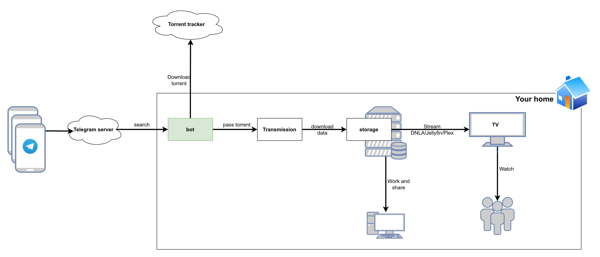
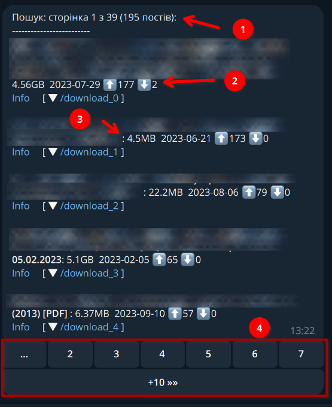
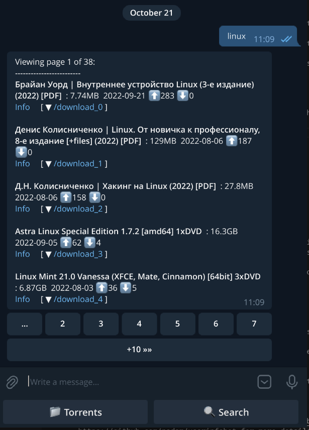

> [!TIP]
> ⭐ If you found this project useful, please consider giving it a star on GitHub. It helps others discover the project and motivates future development. Thank you for your support!

# Transmission Telegram Bot

This Telegram bot searches supported torrent trackers and sends torrent files,
URLs, and magnet links to a Transmission server.

## Features

- **Manage torrents on Transmission**
  - Start, stop, delete, and inspect torrents.
  - Select a download directory before adding a torrent.
  - Add a `.torrent` file, URL, or magnet link from Telegram.
- **Search supported trackers**
  - Search several preconfigured torrent trackers.
  - Sort results by size, date, seeders, or leechers.
- **Control access**
  - Restrict commands to an explicitly configured administrator and an
    allowlist of Telegram user IDs.
  - Invite family members using a short-lived, single-use link or QR code with
    the `/adduser` command.

You can connect Transmission's download directories to Jellyfin, Plex, or
MiniDLNA and stream downloaded media to other devices on your network.



### Supported trackers

- [NNM-Club](https://nnmclub.to/)
- [Rutor](http://rutor.info/)
- [Toloka](https://toloka.to/)
- [RuTracker](https://rutracker.org/)

## Quick start with Docker

1. Install a current Docker Engine with the `docker compose` plugin. As additional step on Windows, please
   enable WSL 2.
2. Create a Telegram bot using [@BotFather](https://t.me/botfather) and save its
   token.
3. Open a terminal (WSL on Windows) and set the bot token first:

   ```shell
   export TOKEN="123456789:replace-with-your-bot-token"
   ```

4. Find your numeric Telegram user ID:

   - Open your new bot in Telegram and send it any message.
   - Request its pending updates:

     ```shell
     curl --silent "https://api.telegram.org/bot${TOKEN}/getUpdates"
     ```

   - In the JSON response, find the latest message and copy the number in
     `message.from.id`. That number is your administrator ID.

   As a simpler alternative, you can message a user-information bot such as
   [@userinfobot](https://t.me/userinfobot) and copy the displayed `Id`. This
   shares your basic Telegram profile with that third-party bot; using your own
   bot and `getUpdates` avoids that disclosure.

5. Set the remaining required values. Replace the examples inside the quotes:

   ```shell
   export SUPER_USER="123456789"
   export TRANSMISSION_USER="torrentino"
   export TRANSMISSION_PASSWORD="replace-with-a-strong-password"
   export TORRENTINO_VERSION="1.4.0"
   ```

6. Download the matching Compose file and start the services:

   ```shell
   curl --fail --location --output docker-compose.yaml \
     https://raw.githubusercontent.com/adskyiproger/transmission-telegram-bot/v${TORRENTINO_VERSION}/docker-compose.yaml
   docker compose --file docker-compose.yaml up --detach
   ```

7. Open Telegram and send `/help` to your bot.

This configuration enables Rutor search and stores downloads in a Docker volume.
Bot configuration, authorized users, download history, and logs are persisted in
the `config` volume.

Useful commands:

```shell
docker compose ps
docker compose logs --follow
docker compose down
```

## Requirements

### Hardware

- A search-only client that connects to an external Transmission server has no
  special hardware requirements.
- When running the bot and Transmission together, use at least 2 GB of RAM and
  provide enough storage for downloads.
- The container images support common x86-64 and ARM64 systems, including Apple
  Silicon and Raspberry Pi.

### Software

- Python 3.14 for local execution, or a current Docker Engine with the
  `docker compose` plugin.
- A Transmission server. Install it from the
  [official download page](https://transmissionbt.com/download) or use the
  container supplied by this project's Compose file.

## Preparation

1. Create a Telegram bot using [@BotFather](https://t.me/botfather).
2. Configure Transmission authentication. See the
   [Transmission setup guide](docs/Transmission-setup.md) or the
   [LinuxServer.io image documentation](https://docs.linuxserver.io/images/docker-transmission/).
3. Register accounts on trackers that require authentication and add their
   credentials to `config/torrentino.yaml`:
   - https://nnmclub.to
   - https://toloka.to
   - https://rutracker.org

## Run locally

1. Clone the repository:

   ```shell
   git clone https://github.com/adskyiproger/transmission-telegram-bot.git
   cd transmission-telegram-bot
   ```

2. Create and edit the configuration file:

   ```shell
   mkdir -p config
   cp templates/torrentino.yaml config/torrentino.yaml
   nano config/torrentino.yaml
   ```

3. Install the locked dependencies and start the bot:

   ```shell
   python -m pip install --user "pipenv==2026.0.3"
   pipenv sync
   pipenv run ./torrentino.py
   ```

Environment variables and command-line arguments override YAML values in memory;
runtime secrets are not written to the configuration file. Run
`pipenv run ./torrentino.py --help` to see the available options.

## Run from a cloned repository with Docker

1. Clone the repository and enter it:

   ```shell
   git clone https://github.com/adskyiproger/transmission-telegram-bot.git
   cd transmission-telegram-bot
   ```

2. Set the required environment variables as shown in
   [Quick start with Docker](#quick-start-with-docker).
3. Start the services:

   ```shell
   docker compose --file docker-compose.yaml up --detach
   ```

The supplied Compose file uses a named volume for `/usr/src/app/config`. To use
a host directory instead, replace the `torrentino` volume with:

```yaml
volumes:
  - ./config:/usr/src/app/config
```

Do not embed tokens or passwords in a container image.

For a Raspberry Pi media-server example, see the
[Home DLNA setup guide](docs/Home-DNLA-setup.md).

## User guide

### Commands

- `/torrents` — list torrents on the Transmission server.
- `/last_search` — show the last search results. Results are cached for 60
  minutes.
- `/stop_all` — stop all torrents.
- `/start_all` — start all torrents.
- `/history` — show successfully completed downloads.
- `/help` — display the help message.
- `/adduser` — generate a single-use invitation link and QR code. This command
  is available only to the administrator.

### Search results

1. The header shows the current page, total pages, and total results.
2. Each result shows seeders (⬆️), leechers (⬇️), size, and publication date.
3. Use the tracker link to open the source page.
4. Use the navigation buttons to change pages or jump by ten pages.



### Main menu

Use **Search** to reopen the last results and **Torrents** to list downloads.



### Adding a user

The administrator can run `/adduser` to generate a short-lived registration
link and QR code.


## Upgrading

See [UPGRADE.md](UPGRADE.md), the [changelog](CHANGELOG.md), and the
[release-specific notes](docs/releases/) before upgrading.
